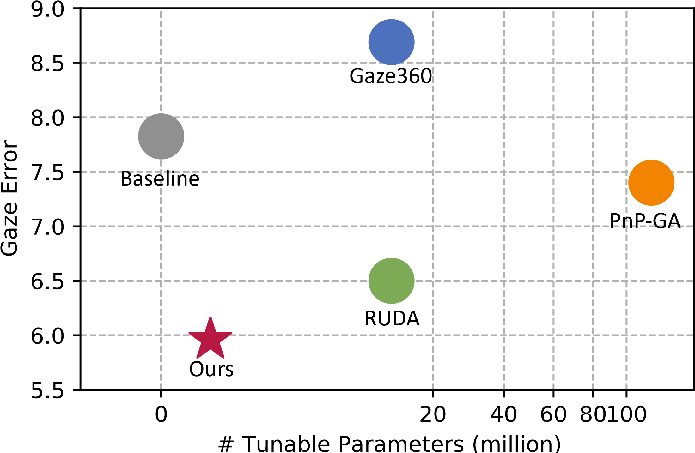

# Test-Time Personalization with Meta Prompt for Gaze Estimation -- AAAI 2024
Official Implementation 

<div align=center>   </div>

**Picture:**  *Illustration of performance comparison in terms of gaze error and tunable parameters. Our method achieved the lowest gaze error with negligible tunable parameters required for personalization.*

## Requirement
* Python 3.8.0
* Pytorch 1.10.2
* CUDA 10.2

## Datasets
ETH-XGaze, Gaze360, MPIIFaceGaze, and EyeDiap datasets are downloaded from their respective official websites.

The datasets are pre-processed using the method outlined in [1]. The code for data pre-processing is released by the authors of [1] and is available at [this page](https://phi-ai.buaa.edu.cn/Gazehub/).

## Dataloader
`reader.py` consists of the dataloader class, please note the dataloader works with the specific format of the pre-processed datasets. The dataloader class needs to be modified accordingly if using another format.

## Usage
### Pretrain
`python3 main.py --train_status=train --train_loader_flag=XXX
    --model_save_dir="XXX" --data_dir="XXX"
    --resnet_model_path="XXX"`

### Test Pretrained Model
`python3 main.py --train_status=test --val_loader_flag=XXX
    --test_data_dir="XXX"
    --resnet_model_path="XXX" --pre_trained_model_path="XXX"`

### Meta Train Using a Pretrained Model and Test
`python3 main.py --train_status=meta_train --train_loader_flag=XXX --val_loader_flag=XXX --batch_size=20
    --model_save_dir="XXX"
    --data_dir="XXX" --test_data_dir="XXX"
    --resnet_model_path="XXX" --pre_trained_model_path="XXX" --pre_trained_model_name="XXX"`

### Personalized Adaptation Using a Meta Trained Model and Test
`python3 main.py --train_status=persona --val_loader_flag=XXX
    --test_data_dir="XXX" 
    --resnet_model_path="XXX" --pre_trained_model_path="XXX" 
	--pre_trained_model_name="XXX" `

**Example usages are provided in `run_gaze360.sh` and `run_xgaze.sh`, please modify the directories and paths accordingly.**

## Citation

If you find this paper or code is helpful in your work, please consider citing:

```latex
@inproceedings{liu2024test,
  title={Test-Time Personalization with Meta Prompt for Gaze Estimation},
  author={Liu, Huan and Qi, Julia and Li, Zhenhao and Hassanpour, Mohammad and Wang, Yang and Plataniotis, Konstantinos N and Yu, Yuanhao},
  booktitle={Proceedings of the AAAI Conference on Artificial Intelligence},
  volume={38},
  number={4},
  pages={3621--3629},
  year={2024}
}
```
## Reference
[1] Cheng, Y.; Wang, H.; Bao, Y.; and Lu, F. 2021. Appearance-based Gaze Estimation With Deep Learning: A Review and Benchmark. arXiv preprint arXiv:2104.12668.
